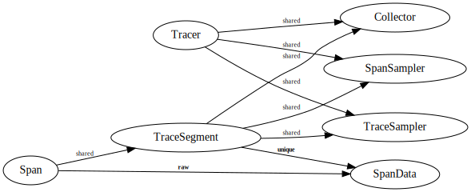

Component Relationships
-----------------------
- Vertices are components.
- Edges are ownership relationships between components.  Each edge is labeled
  by the kind of "smart pointer" that could implement that kind of
  relationship.
- Components containing a padlock are protected by a mutex.



Example Usage
-------------
```C++

#include <datadog/tracing.h>
#include <iostream>

int main() {
    namespace dd = datadog::tracing;

    dd::Config config;
    config.application_version = "1.1";
    config.collector.agent_url = "http://dd-agent:8126";
    config.collector.report_hostname = true;
    config.sampling.trace.sample_rate = 0.1;
    dd::Config::SpanSamplingRule rule;
    rule.service = "mysql";
    rule.name = "exec.*";
    rule.sample_rate = 1.0;
    config.sampling.span.rules.push_back(rule);
    config.on_log = [](dd::LogLevel level, std::string_view message) {
        std::stringstream stream;
        stream << "[Datadog Tracing] [" << level << "]: " << message << '\n';
        std::cerr << stream.rdbuf();
    };
    
    auto maybe_tracer = dd::make_tracer(config);
    if (auto* error = maybe_tracer.get_if<dd::Error>()) {
        std::cerr << "Error configuring tracer: " << *error << '\n';
        return int(error->code);
    }

    auto& tracer = maybe_tracer.get<dd::Tracer>();
    
    auto maybe_span = tracer.extract_span("handle.request", proxy::current_request().headers/*, options*/);
    if (auto* error = maybe_span.get_if<dd::Error>()) {
        std::cerr << "Error extracting tracing context from request: " << *error << '\n';
        return int(error->code);
    }
    auto optional_span = maybe_span.get<std::optional<dd::Span>>();
    if (!optional_span) {
        return 0;  // nothing to demo
    }
    auto& span = *optional_span;

    span.set_tag("something", proxy::current_request().something);
    // ...

    auto peer_info = proxy::find_upstream(proxy::current_request());
    auto maybe_child = span.start_child("upstream.request", /*options*/);
    if (auto* error = maybe_child.get_if<dd::Error>()) {
        std::cerr << "Error creating child span: " << *error << '\n';
        return int(error->code);
    }
    auto& child = maybe_child.get<dd::Span>();

    child.set_tag("upstream.something", peer_info.something);
    // ...

    proxy::make_request(peer_info, [span, child]() {
        // ...
        child.finish();
        proxy::deliver_response(proxy::current_request(), [span]() {
            // ...
            span.finish();
        }));
}
```

Objects (code)
--------------
```C++
class Span {
    std::shared_ptr<SpanData> data_;
    std::shared_ptr<TraceSegment> trace_segment_;
    friend class Tracer;

  public:
    // Does _not_ call `finish`.
    ~Span();

    void finish();

    TraceSegment& trace_segment() const;

    std::variant<Span, Error> start_child(std::string_view name) const;
    std::variant<Span, Error> start_child(const StartChildOptions&) const;
    
    std::optional<Error> inject(DictWriter&) const;
    std::optional<Error> inject(DictWriter&, const InjectOptions&) const;

    void set_tag(std::string_view name, std::string_view value);

    std::string* get_tag(std::string_view name) const;

    void keep_span();

    void drop_span();

    void set_service(std::string_view value);
    const std::string& service();

    // operation name, resource, type, etc.
};
```

```C++
class TraceSegment {
    mutable std::mutex mutex_;
    std::shared_ptr<TraceSegmentData> data_;
    std::shared_ptr<Collector> collector_;
    std::shared_ptr<TraceSampler> trace_sampler_;
    std::shared_ptr<SpanSampler> span_sampler_;

  public:
    // For external use:

    std::optional<Error> inject_sampling_decision(const SamplingDecision&, DictWriter&) const;

    std::optional<Error> extract_sampling_decision(const DictReader&);
    
    std::optional<Error> keep_trace();

    std::optional<Error> drop_trace();

    void set_common_tag(std::string_view name, std::string_view value);

    std::string* get_common_tag(std::string_view name) const;

    // For internal use:
    
    // TODO: constructors

    std::optional<Error> register_span(const std::shared_ptr<SpanData>&);

    std::optional<Error> finish_span(const std::shared_ptr<SpanData>&);
    
    std::optional<Error> set_sampling_decision(const SamplingDecision&);
};
```

```C++
class Tracer {
    Config config_;
    std::shared_ptr<Collector> collector_;
    std::shared_ptr<TraceSampler> trace_sampler_;
    std::shared_ptr<SpanSampler> span_sampler_;

  public:
    std::variant<Span, Error> start_span(std::string_view name) const;
    std::variant<Span, Error> start_span(const StartSpanOptions&) const; 
    
    std::variant<Span, Error> extract_span(std::string_view name, const DictReader&) const;
    std::variant<Span, Error> extract_span(const ExtractSpanOptions&, const DictReader&) const;
};
```

```C++
struct Error {
    class Code {
        int code_;
        friend std::ostream& operator<<(std::ostream&, const Code&);
      public:
        operator int() const;
        operator std::string() const;
    };

    Code code;
    std::string message;
};
```

```C++
class Collector {
  public:
    struct CollectorResponse {
        std::optional<SampleRateUpdates> sample_rate_updates;
        // ...
    };

    using Callback = std::function<void(std::variant<CollectorResponse, Error>)>;
    virtual std::optional<Error> send(const std::shared_ptr<TraceSegmentData>&, Callback) = 0;

    virtual ~Collector();
};
```

Objects (words)
---------------
- _Span_ has a beginning, end, and tags.  It is associated with a _TraceSegment_.
- _TraceSegment_ is part of a trace.  It makes sampling decisions, detects when
  it is finished, and sends itself to the _Collector_.
- _Collector_ receives trace segments.  It provides a callback to deliver
  sampler modifications, if applicable.
- _Tracer_ is responsible for creating trace segments. It contains the
  instances of, and configuration for, the _Collector_, _TraceSampler_, and
  _SpanSampler_.  A tracer is created from a _Config_.
- _TraceSampler_ is used by trace segments to decide when to keep or drop
  themselves.
- _SpanSampler_ is used by trace segments to decide which spans to keep when
  the segment is dropped.
- _Config_ contains all of the information needed to configure the collector,
  trace sampler, and span sampler, as well as defaults for span properties.

Intended usage is:

1. Create a `Config`.
2. Use the `Config` to create a `Tracer`.
3. Use the `Tracer` to create and/or extract local root `Span`s.
4. Use `Span` to create children and/or inject context.
5. Use a `Span`'s `TraceSegment` to perform trace-wide operations.
6. When all `Span`s in ` TraceSegment` are `finish`ed, the segment is sent to
   the `Collector`.

Different instances of `Tracer` are independent of each other.  If an
application wishes to reconfigure tracing at runtime, it can create another
`Tracer` using the new configuration.
