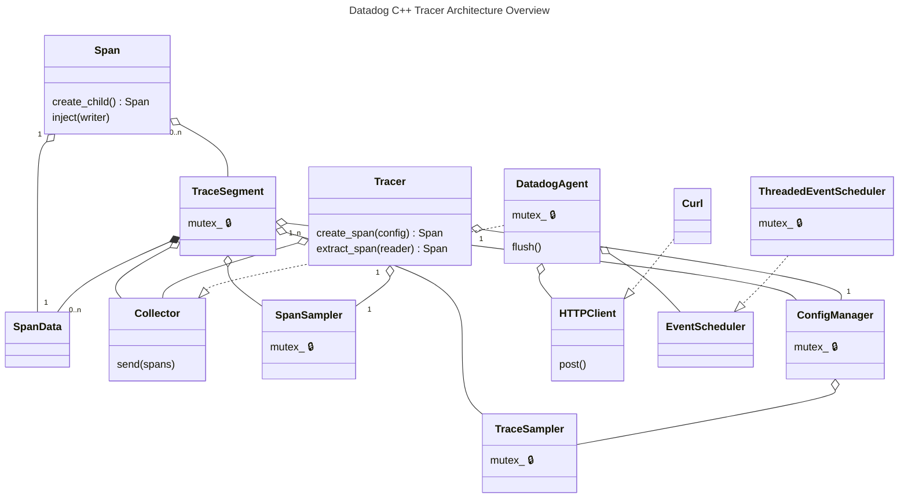
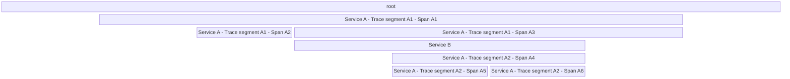

# Datadog C++ Tracer Design

This guide describes salient features of the Datadog C++ Tracer's design.

## Architecture

### Overview



Intended usage is:

1. Create a `TracerConfig`.
2. Use the `TracerConfig` to create a `Tracer`.
3. Use the `Tracer` to create and/or extract local root `Span`s.
4. Use `Span` to create children and/or inject context.
5. Use a `Span`'s `TraceSegment` to perform trace-wide operations.
6. When all `Span`s in a `TraceSegment` are finished, the segment is sent to the `Collector`.

### Span

[Span](../include/datadog/span.h) is the component with which users will interact the most. Each
span:

- has an "ID",
- is associated with a "trace ID",
- is associated with a "service", which has a "service type", a "version", and an "environment",
- has a "name" (sometimes called the "operation name"),
- has a "resource name", which is a description of the thing that the span is about,
- contains information about whether an error occurred during the represented operation, including
  an error message, error type, and stack trace,
- includes an arbitrary name/value mapping of strings, called "tags",
- includes an arbitrary name/value mapping of numbers, called "metrics",
- has a "start time" indicating when the represented operation began,
- has a "duration", known only once it finishes, indicating how long the represented operation took.

Aside from setting and retrieving its attributes, `Span` also has the following operations:

- `Span::create_child()` returns a new `Span` that is a child of this `Span`.
- `Span::inject(writer)` writes trace propagation information to a
  [DictWriter](../include/datadog/dict_writer.h), which is an interface for setting a name/value
  mapping, e.g. in HTTP request headers.

A `Span` does not own its data. `Span` contains a raw pointer to a
[SpanData](../src/datadog/span_data.h), which contains the actual attributes of the `Span`. The
`SpanData` is owned by a `TraceSegment`, which is described in the next section. The `Span` holds a
`shared_ptr` to its `TraceSegment`, retrievable via `Span::trace_segment()`.

By default, a `Span`'s start time is when it is created, and its end time (from which its duration
is calculated) is when it is destroyed. However, a `Span`'s start time can be specified when it is
created, via `SpanConfig::start` (see [span_config.h](../include/datadog/span_config.h)), and a
span's end time can be overridden via `Span::set_end_time()`.

When a `Span` is destroyed, it is considered "finished" and notifies its `TraceSegment`. There is no
way to "finish" a `Span` without destroying it. You can override its end time throughout the
lifetime of the `Span` object, but a `TraceSegment` does not consider the `Span` finished until the
`Span` object is destroyed. This allows us to avoid "finished" `Span` states.

Along similar lines, `Span` is move-only. Its copy constructor is deleted. Functions that produce
`Span`s return them by value, but only one copy of a `Span` can exist at a time.

`Span` is even stricter than move-only: its assignment operator is deleted too, including
move-assignment. Since destroying a `Span` finishes it, move-assignment would have to either finish
the original `Span` early or leave two `Span`s referring to one finished state, both at odds with
its otherwise [RAII](https://en.cppreference.com/w/cpp/language/raii) nature.

Another opinionated property of `Span` is that it is not an interface, nor does it implement an
interface. Usually it is considered polite for a C++ library to deal in handles (`unique_ptr` or
`shared_ptr`) to interfaces, i.e. classes that contain pure virtual functions. This way, a client of
the library can substitute an alternative implementation for the interface(s) for testing or for
when the behavior of the library is not desired.

At the risk of being impolite, `dd-trace-cpp` takes a different approach. `Span` is a concrete type
whose behavior cannot be substituted. Instead, there are other places in the library where
dependency injection can be used to restrict or alter the behavior of the library. The trade-off is
that `Span` and related components must always "go through the motions" of their definitions and
cannot be completely customized, but in exchange the indirection, pointer semantics, and null states
that accompany handle-to-interface are avoided.

### Trace Segment

A "trace" is the entire tree of spans having the same trace ID.

Within one process/worker/service, though, typically there is not an entire trace but only part
of the trace. Let's call the process/worker/service a "tracer".

One portion of a trace that's passing through the tracer is called a "trace segment". A trace
segment begins either at the trace's root span or at a span extracted from trace context, e.g. a
span created from the `X-Datadog-Trace-Id` and `X-Datadog-Parent-Id` HTTP request headers. The trace
segment includes all local descendants of that span, and has as its "boundary" any descendant spans
without children or descendant spans that were used to inject trace context out-of-tracer (described
in a subsequent section).

There might be more than one trace segment for the _same trace_ within a tracer. For example, in the
diagram below, the trace passes through the "Service A" tracer twice. So for this trace, this tracer
has two trace segments:



`TraceSegment` is defined in [trace_segment.h](../include/datadog/trace_segment.h). `TraceSegment`
objects are managed internally by the library. That is to say, a user never creates a
`TraceSegment`.

The library creates a `TraceSegment` whenever a new trace is created or when trace context is
extracted. This is the job of `Tracer`, described in the next section.

Primarily, `TraceSegment` is a bag of `Span`s. It contains a `vector<unique_ptr<SpanData>>`. `Span`
objects then refer to the `SpanData`s via raw pointers.

When one of a `TraceSegment`'s `Span`s creates a child, the child is registered with the
`TraceSegment`. When a `Span` is finished, the `TraceSegment` is notified. The `TraceSegment` keeps
track of how many `Span`s it contains (the size of its `vector`) and how many `Span`s are finished.
When the two numbers are equal, the `TraceSegment` is finished.

When a `TraceSegment` is finished, it uses a `TraceSampler` to decide whether to keep or drop
itself, and, if it is dropped, a `SpanSampler` to decide which `Span`s to keep anyway. It then
performs finalization logic in order to prepare its `Span`s for submission to the `Collector`. Then
it moves its `Span`s into the `Collector` via `Collector::send()`, and a short time later the
`TraceSegment` is destroyed. See `TraceSegment::span_finished()`. `Collector` is described in a
subsequent section.

A `TraceSegment` contains `shared_ptr`s to the main objects it needs in order to do its job. Those
objects are created by `Tracer` when it is configured, and then shared with `TraceSegment` when the
`TraceSegment` is created.

### Tracer

`Tracer` is what users configure, and it is how `Span`s are extracted from trace context or created
as a trace's root. See [tracer.h](../include/datadog/tracer.h).

A `Tracer` owns a `Collector`, a `SpanSampler`, and a `ConfigManager`. `SpanSampler` and
`ConfigManager` are owned exclusively by one `Tracer`. `ConfigManager` in turn owns a
`TraceSampler`.

Different `Tracer` instances are independent of each other, even if they share a `Collector`.

A `Tracer` is constructed from a `TracerConfig`, which configures these objects and many other
aspects of a `Tracer`'s behavior (span defaults, propagation styles, telemetry, and more; see
[tracer_config.h](../include/datadog/tracer_config.h)). To change most of a `Tracer`'s behavior, an
application constructs a new `Tracer` from a new `TracerConfig`.

`Tracer` has two main member functions: `Tracer::create_span()` and `Tracer::extract_span()`, and
another that combines them: `Tracer::extract_or_create_span()`.

All of these result in the creation of a new `TraceSegment` (or otherwise return an error). The
`Tracer`'s data members, which were initialized based on the tracer's configuration, are passed to
the `TraceSegment` so that the `TraceSegment` can operate independently.

Note how `Tracer::create_span()` never fails, whereas `Tracer::extract_span()` can fail.

The bulk of `Tracer`'s implementation is `Tracer::extract_span()`. The other substantial work is
configuration, which is handled by `finalize_config(const TracerConfig&)`, declared in
[tracer_config.h](../include/datadog/tracer_config.h). Configuration will be described in more depth
in a subsequent section.

### Trace Context Propagation

Trace context propagation is how spans in different tracers become part of the same trace. When a
trace crosses a tracer boundary (e.g. an outgoing HTTP request), the trace ID, the ID of the span
that initiated the request, and the trace's sampling decision must travel with it, so that the
receiving tracer can create spans belonging to the same trace.

There are two directions:

- Injection: `Span::inject()` writes the current trace context into a carrier (e.g. outgoing HTTP
  headers).
- Extraction: `Tracer::extract_span()` reads trace context from a carrier (e.g. incoming HTTP
  headers), and uses it to create a `Span` that continues the trace.

Several wire formats, "propagation styles", are supported. A `Tracer` can be configured with
multiple styles for both injection and extraction.

A trace's sampling decision, once made, is part of what gets propagated: every tracer the trace
passes through agrees on whether it's kept or dropped, rather than deciding independently.

Propagation can also be suppressed: if tracing is disabled for a trace and no other product depends
on it continuing, context is not injected at all.

`Tracer` can also propagate `Baggage`, an OpenTelemetry-like key/value store for application data.
It is defined in [baggage.h](../src/datadog/baggage.h). It is enabled by a trace context propagation
style, and it uses the same carrier abstraction. `Tracer::create_baggage()` creates one,
`Tracer::extract_baggage()` / `Tracer::extract_or_create_baggage()` read one from a carrier, and
`Tracer::inject()` writes one to a carrier.

### Collector

`Collector` is an interface for sending a `TraceSegment`'s spans somewhere once they're all done.
It's defined in [collector.h](../include/datadog/collector.h).

It has one main function: `Collector::send()`. More of a callback than an interface. `send()` also
takes a `TraceSampler` as a `response_handler`, which an implementation may use to update the trace
sampling rates based on the response it gets back when delivering spans (e.g. from the Datadog
Agent).

A `Collector` is either created by `Tracer` or injected into its configuration. A `Collector` can be
shared by several `Tracer`s. The `Collector` is then shared with all `TraceSegment`s created by the
`Tracer`. The only thing that a `TraceSegment` does with the `Collector` is call `Collector::send()`
once the segment is finished.

The default implementation is `DatadogAgent`, which is described in the next section.

### DatadogAgent

`DatadogAgent` is the default implementation of `Collector`. It's defined in
[datadog_agent.h](../src/datadog/datadog_agent.h).

`DatadogAgent` sends trace segments to the [Datadog Agent](https://docs.datadoghq.com/agent) in
batches that are flushed periodically. In order to do this, `DatadogAgent` needs a means to make
HTTP requests and a means to set a timer for the flush operation. So, there are two interfaces:
[HTTPClient](../include/datadog/http_client.h) and
[EventScheduler](../include/datadog/event_scheduler.h).

The `HTTPClient` and `EventScheduler` can be injected as part of `DatadogAgent`'s
[configuration](../include/datadog/datadog_agent_config.h), which is usually specified via the
`agent` member of `Tracer`'s [configuration](../include/datadog/tracer_config.h). If they're not
specified, then default implementations are used: `Curl` and `ThreadedEventScheduler` (described in
subsequent sections).

`DatadogAgent::flush()` is periodically called by an `EventScheduler`. `flush()` uses the HTTP
client to send a `POST` request to the Datadog Agent's `/v0.4/traces` endpoint. It's all
callback-based.

`DatadogAgent` also periodically polls the Agent's `/v0.7/config` endpoint for Remote Configuration
updates, via `EventScheduler`. Responses are dispatched to registered `remote_config::Listener`s,
including `ConfigManager`, which is how sampling rate/rules, trace reporting, and tags can be
reconfigured at runtime (without creating a new `Tracer`).

### HTTPClient

`HTTPClient` is an interface for sending HTTP requests. It's defined in
[http_client.h](../include/datadog/http_client.h).

The only needed HTTP method is `POST` (for requests to the Datadog Agent's endpoints). `HTTPClient`
has one member function for each HTTP method needed, so, currently just `HTTPClient::post()`. It's
callback-based and returns almost immediately.

`HTTPClient` also has another method, `HTTPClient::drain()`, which waits for any in-flight requests
to finish. It's used to ensure "clean shutdown". Without it, on average the last one second of
traces would be lost on shutdown. Implementations of `HTTPClient` that don't have a dedicated thread
need not support `drain()`; in those cases, `drain()` returns immediately.

The default implementation of `HTTPClient` is `Curl`, defined in [curl.h](../src/datadog/curl.h),
which uses libcurl's [multi interface](https://curl.se/libcurl/c/libcurl-multi.html) together with a
dedicated thread as an event loop.

`Curl` is also used in Datadog's Nginx module,
[nginx-datadog](https://github.com/DataDog/nginx-datadog). This is explicitly
[discouraged](https://nginx.org/en/docs/dev/development_guide.html#http_requests_to_ext) in Nginx's
developer documentation, but libcurl-with-a-thread is widely used within Nginx modules regardless.
One possible improvement would be using libcurl's
"[multi_socket](https://curl.se/libcurl/c/curl_multi_socket_action.html)" mode, which allows libcurl
to utilize someone else's event loop, obviating the need for another thread. libcurl can then be
made to use Nginx's event loop, as is done in [an example
library](https://github.com/dgoffredo/nginx-curl).

[Envoy's Datadog tracing
integration](https://github.com/envoyproxy/envoy/tree/main/source/extensions/tracers/datadog#datadog-tracer)
uses a different implementation,
[AgentHTTPClient](https://github.com/envoyproxy/envoy/blob/main/source/extensions/tracers/datadog/agent_http_client.h),
which uses Envoy's built-in HTTP facilities. libcurl is not involved at all.

### EventScheduler

`DatadogAgent` uses an `EventScheduler` to schedule its recurring work, at fixed intervals.

`EventScheduler` is an interface defined in
[event_scheduler.h](../include/datadog/event_scheduler.h). It has one main member function,
`EventScheduler::schedule_recurring_event()`, which registers a callback to be invoked repeatedly.

The default implementation of `EventScheduler` is `ThreadedEventScheduler`, defined in
[threaded_event_scheduler.h](../src/datadog/threaded_event_scheduler.h), which uses a dedicated
thread for executing scheduled events at the correct time.

[Datadog Nginx module](https://github.com/DataDog/nginx-datadog) uses a different implementation,
[NgxEventScheduler](https://github.com/DataDog/nginx-datadog/blob/master/src/ngx_event_scheduler.h),
which uses Nginx's own event loop instead of a dedicated thread.

[Envoy's Datadog tracing
integration](https://github.com/envoyproxy/envoy/tree/main/source/extensions/tracers/datadog#datadog-tracer)
also uses a different implementation,
[EventScheduler](https://github.com/envoyproxy/envoy/blob/main/source/extensions/tracers/datadog/event_scheduler.h),
which uses Envoy's built-in event dispatch facilities.

## Operational Aspects

### Configuration

This library encodes configuration validation into the type system (see ["Parse, don't validate" by
Alexis King](https://lexi-lambda.github.io/blog/2019/11/05/parse-don-t-validate)). Invalid states
are forbidden by making configurable components accept a different, validated type than the one used
to specify configuration.

The configuration of `Tracer` is `TracerConfig`, but in order to construct a `Tracer` you must first
convert the `TracerConfig` into a `FinalizedTracerConfig` by calling `finalize_config()`. If there
is anything wrong with the `TracerConfig` or with environment variables that would override it,
`finalize_config()` will return an `Error` instead of a `FinalizedTracerConfig`. In that case, you
can't create a `Tracer` at all.

This technique applies to multiple components:

| Component | Unvalidated | Validated | Parser |
| --------- | ----------- | --------- | ------ |
| `Tracer` | `TracerConfig` | `FinalizedTracerConfig` | `finalize_config()` in [tracer_config.h](../include/datadog/tracer_config.h) |
| `DatadogAgent` | `DatadogAgentConfig` | `FinalizedDatadogAgentConfig` |  `finalize_config()` in [datadog_agent_config.h](../include/datadog/datadog_agent_config.h) |
| `TraceSampler` | `TraceSamplerConfig` | `FinalizedTraceSamplerConfig` |  `finalize_config()` in [trace_sampler_config.h](../include/datadog/trace_sampler_config.h) |
| `SpanSampler` | `SpanSamplerConfig` | `FinalizedSpanSamplerConfig` |  `finalize_config()` in [span_sampler_config.h](../include/datadog/span_sampler_config.h) |
| multiple | `double` | `Rate` | `Rate::from()` in [rate.h](../include/datadog/rate.h) |

One other convention of the library is that `FinalizedFooConfig` (for some `Foo`) is never a data
member of the configured component class. That is, `FinalizedTracerConfig` is not stored in
`Tracer`. Instead, a constructor might individually copy the finalized config's data members. This
is to prevent eventual intermixing between the "configuration representation" and the "runtime
representation". In part, `finalize_config()` already mitigates the problem. Abstaining from storing
the finalized config as a data member is a step further.

This static validation happens once, at construction. `ConfigManager`, which is a `Tracer` member,
separately allows some configuration to change afterward, via a Remote Configuration update, rather
than through `finalize_config()`. This path is also validated, by a different parser.

### Error Handling

Most error scenarios within this library are enumerated by `enum Error::Code`, defined in
[error.h](../include/datadog/error.h). The integer values of the enumerated `Error::Code`s are
intended to be permanent.

In addition to an error code, each error condition is associated with a contextual diagnostic
message. The diagnostic is not only a description of the error, but also contains runtime context
that might help a user or a maintainer identify the underlying issue.

The `Error::Code code` and `std::string message` are combined in a `struct Error`, which is the
error type used by this library.

`Error` has a convenience member function, `Error::with_prefix()`, that allows context to be added
to an error. It's analogous to `catch`ing one exception and then `throw`ing another.

`Error` is most often used in conjunction with the `Expected` class template, which is defined in
[expected.h](../include/datadog/expected.h). `template <T, Error> class Expected` is either a `T` or
an `Error`. It is a wrapper around `std::variant<T, Error>`. It's inspired by C++23's
[std::expected](https://en.cppreference.com/w/cpp/utility/expected), but the two are not compatible.

Functions in this library that intend to return a `Value`, but that might instead fail with an
`Error`, return an `Expected<Value>`.

This library never reports errors by throwing an exception. However, the library will allow
exceptions, such as `std::bad_alloc` and `std::bad_variant_access`, to pass through it, and does
sometimes use exceptions internally. The intention is that a client of this library does not need to
write `catch`. For a tracing library embedded in proxies, the ergonomics of error values are a
better fit than exceptions.

`Expected` supports two syntaxes of use. The first is
[std::get_if()](https://en.cppreference.com/w/cpp/utility/variant/get_if)-style unpacking with the
`if_error()` member function:

```c++
Expected<Salad> lunch = go_buy_lunch();
if (Error *error = lunch.if_error()) {
  return error->with_prefix("Probably getting a hotdog instead: ");
}
eat_salad(*lunch);  // or, lunch.value()
```

`if_error()` cannot be called on an
[rvalue](https://en.cppreference.com/w/cpp/language/value_category), because allowing this makes it
far too easy to obtain a pointer to a destroyed object.

The other syntax of use supported by `Expected` is the traditional check-and-accessor pattern:

```c++
Expected<Salad> lunch = go_buy_lunch();
if (!lunch) {
  return lunch.error().with_prefix("Probably getting halal instead: ");
}
eat_salad(*lunch);  // or, lunch.value()
```

`Expected` defines `explicit operator bool`, which is `true` if the `Expected` contains a
non-`Error`, and `false` if the `Expected` contains an `Error`. There is also `has_value()`, which
returns the same thing. Then the `Error` can be obtained via `error()`, or the non-`Error` can be
obtained via `value()`, `operator*()`, or `operator->()`.

`template <T> class Expected` has one specialization: `Expected<void>`, which is "either an `Error`
or nothing". It's used to convey the result of an operation that might fail but that doesn't yield a
value when it succeeds. It behaves in the same way as `Expected<T>`, except that `value()` and
`operator*()` are not defined. `Expected<void>` is implemented in terms of `std::optional<Error>`,
but inverts the value of `explicit operator bool`.

### Logging

This library has a logging interface alongside its `Expected`/`Error` reporting, because the default
`HTTPClient`/`EventScheduler` implementations do work on background threads where errors can occur
with no caller to hand them to. A logging interface lets those errors, startup diagnostics and
configuration warnings be logged by default, rather than requiring client code to opt in via an
`on_error` callback.

The logging interface is `Logger`, defined in [logger.h](../include/datadog/logger.h).

`Logger` has only two severities, "error" and "startup":

- `Logger::log_startup()` is called once by `Tracer` at initialization;
- `Logger::log_error()` handles every other case.

To avoid paying the cost of building a diagnostic message when it won't be logged, both accept a
`std::function` (`Logger::LogFunc`) that builds the message only if the implementation actually
chooses to log.

`Logger::log_error()` also has two convenience overloads, one taking an `Error` and one a
`StringView`. The `Error` overload doesn't get the deferred-cost benefit, since `Error::message` is
already built by the time an `Error` exists.

The default implementation of `Logger` is `NullLogger`, defined in
[null_logger.h](../src/datadog/null_logger.h). `NullLogger` doesn't log anything.

A client library might wish to install `CerrLogger` instead. `CerrLogger` is defined in
[cerr_logger.h](../include/datadog/cerr_logger.h) and logs to
[std::cerr](https://en.cppreference.com/w/cpp/io/cerr) in both `log_error` and `log_startup`.

A `Tracer`'s `Logger` is provided by `TracerConfig`.
