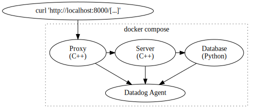

Example HTTP Server
===================
This directory contains a [docker compose][1] setup for a system consisting of
three HTTP services and a [Datadog Agent][2].

The "server" service is a note-taking app written in C++. Its source code is is
in the [server/](server/) directory. See [server/server.cpp](server/server.cpp).
It uses a modified version of [cpp-httplib][3] to accept and make HTTP requests.

A reverse proxy sits in front of the server, and the reverse proxy is exposed to
the host by binding to port 8000.

The note-taking app provides the following endpoints:

- _GET /notes_
    - Return `application/json` containing an array of notes, where each notes
      is an array containing the note's creation time and body text.
      For example, `[["2023-05-12 16:18:37","here is another note"],["2023-05-12 15:06:10","this is my note"]]`.
- _POST /notes_
    - Insert the request body into the database as a new note.
- _GET /sleep?seconds=[duration]_
    - Wait for the specified `[duration]` number of seconds before responding.

The [bin/http-server-example](../../bin/http-server-example) script builds the
three services, starts them, and begins tailing their logs. The "server" build
uses a GitHub release of dd-trace-cpp, rather than using the current source
tree. `bin/http-server-example` requires a Datadog API key via the `DD_API_KEY`
environment variable.

Once the services are started, requests can be made to `127.0.0.1:8000`. Traces
will appear in the Datadog UI. The `docker compose` services have the following
Datadog service names:

| docker compose service name | Datadog service name |
| --------------------------- | -------------------- |
| proxy                       | dd-trace-cpp-http-server-example-proxy |
| server                      | dd-trace-cpp-http-server-example-server |
| database                    | dd-trace-cpp-http-server-example-database |

Example Usage
-------------
TODO

[1]: https://docs.docker.com/compose/
[2]: https://docs.datadoghq.com/agent/
[3]: https://github.com/yhirose/cpp-httplib
